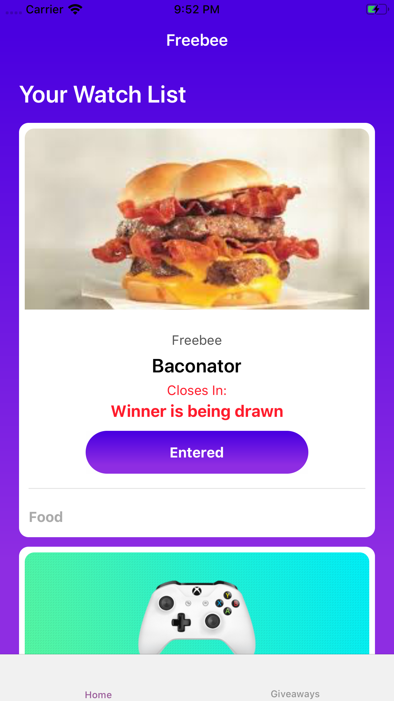
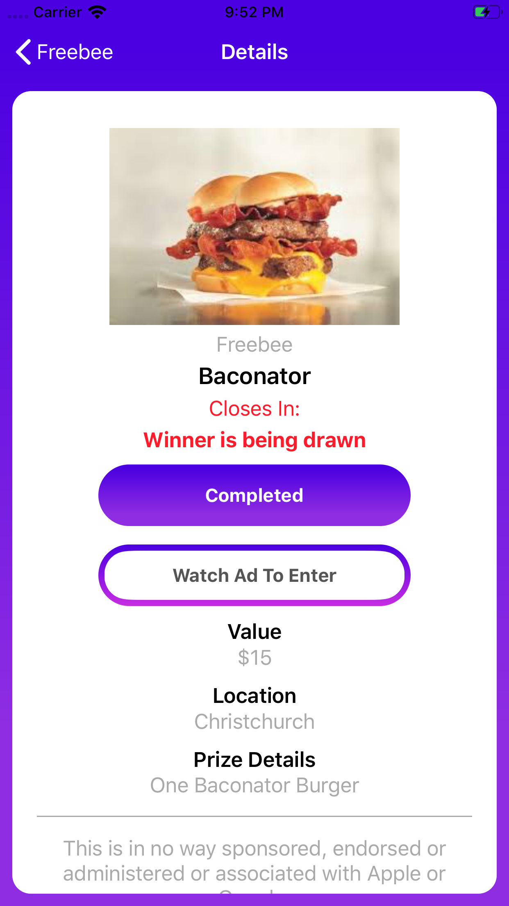
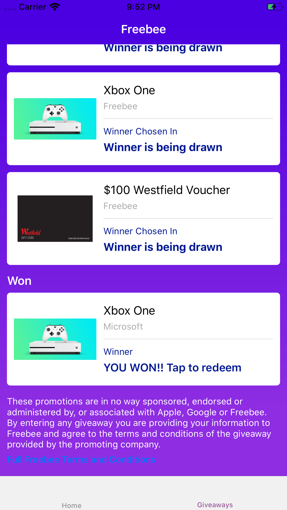
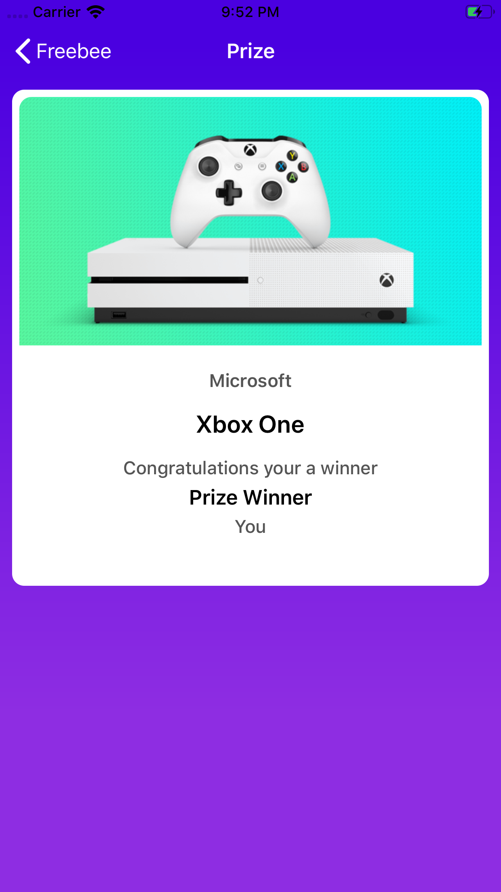
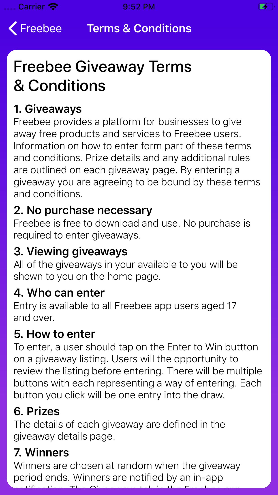

# Freebee

My cousin has an app on the app store called Freebee. I was going to remake the app so i could make it cheaper for him 
to add features. I stopped half way through because i was still studying and didn't have enough free time to make 
a commercially ready application. 

